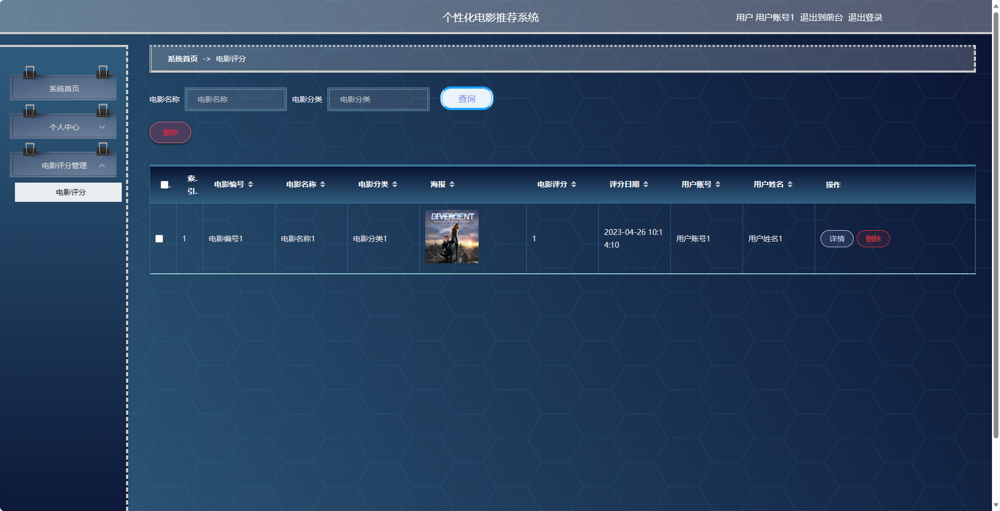
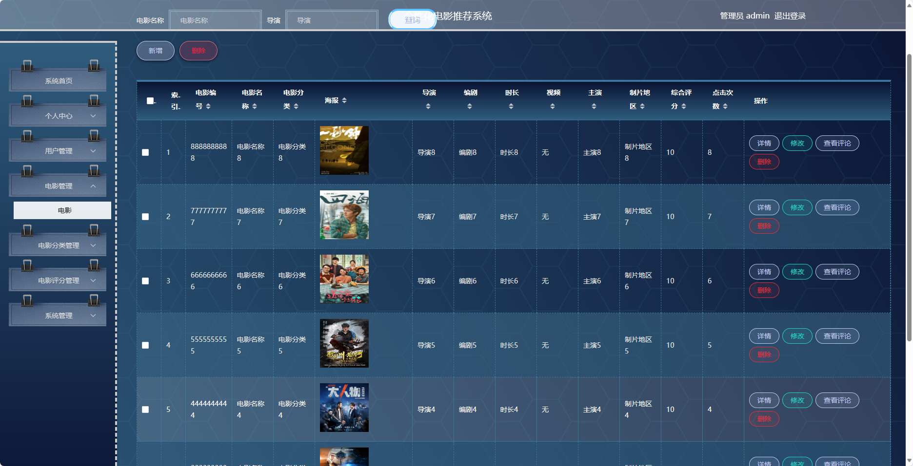
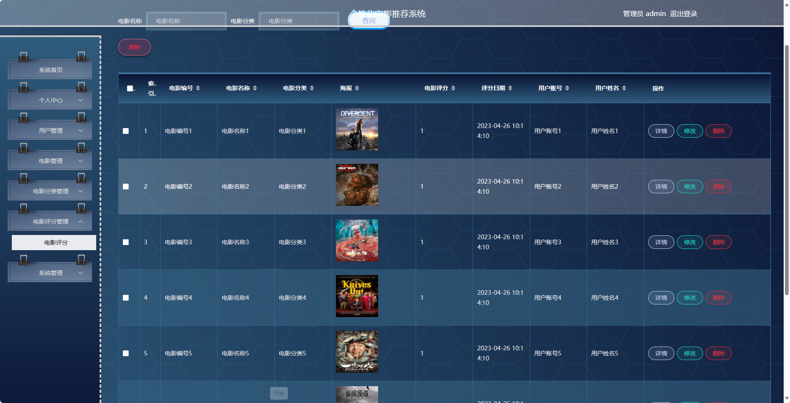

## 基于SpringBoot的个性化电影推荐系统

- <b>完整代码获取地址：从戎源码网 ([https://armycodes.com/](https://armycodes.com/))</b>
- <b>技术探讨、资料分享，请加QQ群：692619798</b> 
- <b>作者微信：19941326836  QQ：952045282</b> 
- <b>承接计算机毕业设计、Java毕业设计、Python毕业设计、深度学习、机器学习</b>
- <b>选题+开题报告+任务书+程序定制+安装调试+论文+答辩ppt 一条龙服务</b>
- <b>所有选题地址 ([https://github.com/YuLin-Coder/AllProjectCatalog](https://github.com/YuLin-Coder/AllProjectCatalog)) </b>

## 项目介绍
基于SpringBoot的个性化电影推荐系统，系统包含两种角色：管理员、用户,系统分为前台和后台两大模块，主要功能如下。

### 【管理员】:
- 个人中心：管理管理员的个人信息，包括修改密码等操作。
- 用户管理：管理用户的个人信息。
- 电影管理：发布和管理电影信息，包括添加电影、编辑电影、删除电影等操作。
- 电影分类管理：管理系统中电影的分类信息。
- 电影评分管理：管理用户对电影的评分情况。
- 系统管理：管理系统的基础数据。

### 【前台】:
- 首页：展示系统的概览信息、推荐电影等内容。
- 电影：用户可以查看、搜索、筛选电影信息。
- 电影评分：用户可以对自己看过的电影进行评分。
- 电影资讯：提供各种电影相关的资讯。
- 个人中心：用户管理个人信息，包括修改密码、查看历史记录等操作。

## 项目技术
- 编程语言：Java
- 数据库：MySQL
- 项目管理工具：Maven
- 前端技术：HTML、CSS、JavaScript、Jquery、Vue
- 后端技术：Spring、SpringMVC、MyBatis

## 运行环境
- JDK版本：JDK1.8及以上
- 开发工具：IDEA、Ecplise、Myecplise都可以
- 数据库: MySQL5.7及以上
- Maven：maven3.0及以上
- Node：14.14.0及以上

## 运行截图

